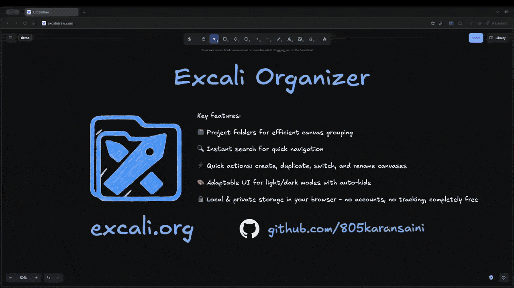

# Excali Organizer

<div align="center">
  

  **Una poderosa extensión de Chrome que transforma tu experiencia en Excalidraw**

  [](LICENSE)
  [](public/manifest.json)
  [](https://excali.org)
  [](https://chromewebstore.google.com/detail/excali-organizer/ofhbmolegnmdaoblohnojkdmijemmohe)
  [](https://deepwiki.com/805karansaini/excali-org)
  <!-- -->
  <a href="https://chromewebstore.google.com/detail/excali-organizer/ofhbmolegnmdaoblohnojkdmijemmohe">Instalar desde Chrome Web Store</a>
</div>

## 🚀 Descripción General

[Excali Organizer](excali.org) es una extensión de Chrome rica en funciones que mejora [Excalidraw.com](https://excalidraw.com) al añadir potentes capacidades de gestión y organización de archivos. Transforma tu flujo de trabajo de dibujo con organización basada en proyectos, búsqueda avanzada y una integración fluida que se siente nativa de Excalidraw.

### ✨ Características Principales

- **📁 Organización por Proyectos** - Agrupa dibujos relacionados en proyectos con colores y descripciones personalizadas
- **🔍 Búsqueda Avanzada** - Encuentra dibujos al instante con búsqueda difusa (fuzzy search) y filtrado por proyecto
- **🔄 Gestión de Lienzos** - Crea, duplica, renombra y organiza dibujos sin esfuerzo
- **⚡ Atajos de Teclado** - Flujo de trabajo completamente impulsado por teclado para usuarios avanzados
- **💾 Auto-Guardado** - Sincronización automática con almacenamiento IndexedDB
- **🎨 Sincronización de Temas** - Integración perfecta con los temas claro/oscuro de Excalidraw

## 🎥 Video Promocional

<div align="center">
  
  <p><em>Recorrido rápido por las funciones de Excali Organizer</em></p>
</div>

## 🛠️ Instalación

- Instala desde Chrome Web Store (recomendado): [Excali Organizer en la Chrome Web Store](https://chromewebstore.google.com/detail/excali-organizer/ofhbmolegnmdaoblohnojkdmijemmohe)

- ¡Visita [excalidraw.com](https://excalidraw.com) para comenzar a usar la extensión!


### Para Desarrolladores

```bash
# Clonar el repositorio
git clone https://github.com/805karansaini/excali-org.git
cd excali-org

# Instalar dependencias
npm install

# Construir la extensión
npm run build

# Cargar la extensión en Chrome
# 1. Abrir chrome://extensions/
# 2. Activar el "Modo de desarrollador"
# 3. Hacer clic en "Cargar descomprimida" y seleccionar la carpeta `dist`
```

## ⌨️ Atajos de Teclado

| Acción | Windows/Linux | Mac | Descripción |
|--------|---------------|-----|-------------|
| Ayuda | `F1` | `F1` | Mostrar atajos de teclado |
| Alternar Panel | `Ctrl + B` | `Cmd + B` | Mostrar/ocultar el panel organizador |
| Buscar | `Ctrl + Shift + F` | `Cmd + Shift + F` | Abrir búsqueda universal |
| Nuevo Lienzo | `Alt + N` | `Option + N` | Crear un nuevo dibujo |
| Duplicar Lienzo | `Ctrl + Shift + D` | `Cmd + Shift + D` | Duplicar lienzo actual |
| Eliminar Lienzo | `Alt + Delete` | `Option + Delete` | Eliminar lienzo seleccionado |
| Renombrar Lienzo | `F2` | `F2` | Renombrar lienzo seleccionado |
| Nuevo Proyecto | `Alt + Shift + N` | `Option + Shift + N` | Crear un nuevo proyecto |
| Cerrar Modales | `Esc` | `Esc` | Cerrar modales |


## 🔒 Privacidad y Seguridad

- **Almacenamiento local único**: Todos los datos permanecen en tu navegador
- **Sin solicitudes externas**: La extensión funciona completamente offline
- **Sin rastreo**: Sin analíticas ni seguimiento de usuarios
- **Código abierto**: Transparencia total con licencia MIT*

Consulta nuestra [Política de Privacidad](PRIVACY_POLICY.md) para más detalles.

## 🤝 Contribuir

¡Bienvenidos los colaboradores!

### Inicio Rápido para Colaboradores

1. Haz un fork del repositorio
2. Crea una rama de función: `git checkout -b feature/amazing-feature`
3. Envía un pull request

## 📄 Licencia

Este proyecto está bajo la Licencia MIT* con restricciones de uso adicionales. Consulta el archivo [LICENSE](LICENSE) para más detalles.

## 🔗 Enlaces

- **Página Principal**: [excali.org](https://excali.org)
- **Chrome Web Store**: [Instalar Excali Organizer](https://chromewebstore.google.com/detail/excali-organizer/ofhbmolegnmdaoblohnojkdmijemmohe)
- **Excalidraw**: [excalidraw.com](https://excalidraw.com)
- **Reportar Problemas**: [GitHub Issues](https://github.com/805karansaini/excali-org/issues)

## ❤️ Agradecimientos

- Al [equipo de Excalidraw](https://github.com/excalidraw/excalidraw) por la increíble aplicación de dibujo
- Al [equipo de React](https://react.dev) por el excelente framework
- A [Chrome Extensions](https://developer.chrome.com/docs/extensions/) por la plataforma

---

<div align="center">
  <strong>Hecho con ❤️ para la comunidad de Excalidraw</strong>
  <br>
  <sub>¡Transforma tu flujo de trabajo de dibujo hoy mismo!</sub>
</div>
