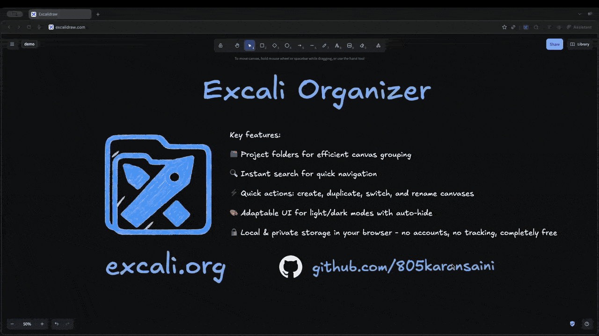

# Excali Organizer

<div align="center">
  

  **A powerful Chrome extension that transforms your Excalidraw experience**

  [](LICENSE)
  [](public/manifest.json)
  [](https://excali.org)
  [](https://chromewebstore.google.com/detail/excali-organizer/ofhbmolegnmdaoblohnojkdmijemmohe)
  [](https://deepwiki.com/805karansaini/excali-org)
  <!-- -->
  <a href="https://chromewebstore.google.com/detail/excali-organizer/ofhbmolegnmdaoblohnojkdmijemmohe">Install from Chrome Web Store</a>
</div>

## 🚀 Overview

[Excali Organizer](excali.org) is a feature-rich Chrome extension that enhances [Excalidraw.com](https://excalidraw.com) by adding powerful file management and organization capabilities. Transform your drawing workflow with project-based organization, advanced search, and seamless integration that feels native to Excalidraw.

### ✨ Key Features

- **📁 Project Organization** - Group related drawings into projects with custom colors and descriptions
- **🔍 Advanced Search** - Find drawings instantly with fuzzy search and project drill-down
- **🔄 Canvas Management** - Create, duplicate, rename, and organize drawings effortlessly
- **⚡ Keyboard Shortcuts** - Complete keyboard-driven workflow for power users
- **💾 Auto-Save** - Automatic synchronization with IndexedDB storage
- **🎨 Theme Sync** - Seamless integration with Excalidraw's light/dark themes

## 🎥 Promo Video

<div align="center">
  
  <p><em>Quick tour of Excali Organizer features</em></p>
</div>

## 🛠️ Installation

- Install from Chrome Web Store (recommended): [Excali Organizer on the Chrome Web Store](https://chromewebstore.google.com/detail/excali-organizer/ofhbmolegnmdaoblohnojkdmijemmohe)

- Visit [excalidraw.com](https://excalidraw.com) to start using the extension!


### For Developers

```bash
# Clone the repository
git clone https://github.com/805karansaini/excali-org.git
cd excali-org

# Install dependencies
npm install

# Build the extension
npm run build

# Load the extension in Chrome
# 1. Open chrome://extensions/
# 2. Enable "Developer mode"
# 3. Click "Load unpacked" and select the `dist` folder
```

## ⌨️ Keyboard Shortcuts

| Action | Windows/Linux | Mac | Description |
|--------|---------------|-----|-------------|
| Help | `F1` | `F1` | Show keyboard shortcuts |
| Toggle Panel | `Ctrl + B` | `Cmd + B` | Show/hide the organizer panel |
| Search | `Ctrl + Shift + F` | `Cmd + Shift + F` | Open universal search |
| New Canvas | `Alt + N` | `Option + N` | Create a new drawing |
| Duplicate Canvas | `Ctrl + Shift + D` | `Cmd + Shift + D` | Duplicate current canvas |
| Delete Canvas | `Alt + Delete` | `Option + Delete` | Delete selected canvas |
| Rename Canvas | `F2` | `F2` | Rename selected canvas |
| New Project | `Alt + Shift + N` | `Option + Shift + N` | Create a new project |
|Close Modals|`Esc`|`Esc`|Close Modals|


## 🔒 Privacy & Security

- **Local-only storage**: All data stays in your browser
- **No external requests**: Extension works completely offline
- **No tracking**: No analytics or user tracking
- **Open source**: Full transparency with MIT* license

See our [Privacy Policy](PRIVACY_POLICY.md) for complete details.

## 🤝 Contributing

We welcome contributions!

### Quick Start for Contributors

1. Fork the repository
2. Create a feature branch: `git checkout -b feature/amazing-feature`
3. Submit a pull request

## 📄 License

This project is licensed under the MIT* License with additional usage restrictions. See the [LICENSE](LICENSE) file for details.

## 🔗 Links

- **Homepage**: [excali.org](https://excali.org)
- **Chrome Web Store**: [Install Excali Organizer](https://chromewebstore.google.com/detail/excali-organizer/ofhbmolegnmdaoblohnojkdmijemmohe)
- **Excalidraw**: [excalidraw.com](https://excalidraw.com)
- **Report Issues**: [GitHub Issues](https://github.com/805karansaini/excali-org/issues)

## ❤️ Acknowledgments

- [Excalidraw team](https://github.com/excalidraw/excalidraw) for the amazing drawing application
- [React team](https://react.dev) for the excellent framework
- [Chrome Extensions](https://developer.chrome.com/docs/extensions/) for the platform

---

<div align="center">
  <strong>Made with ❤️ for the Excalidraw community</strong>
  <br>
  <sub>Transform your drawing workflow today!</sub>
</div>
